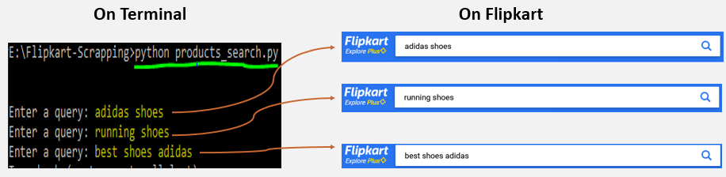
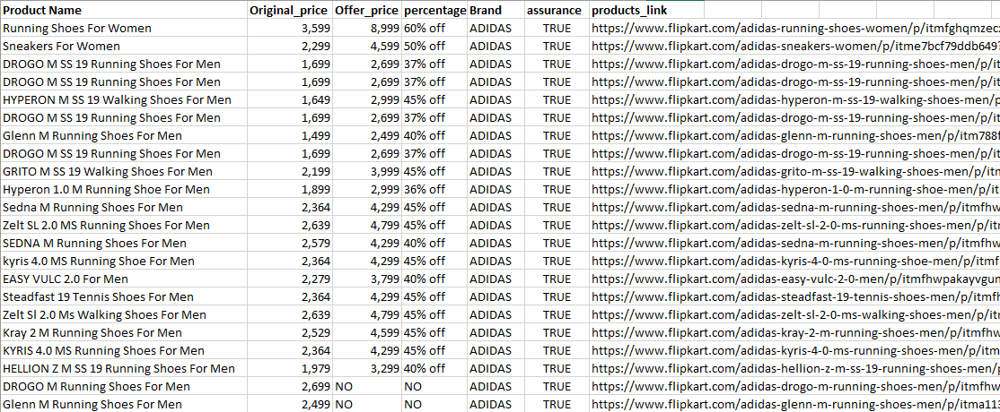
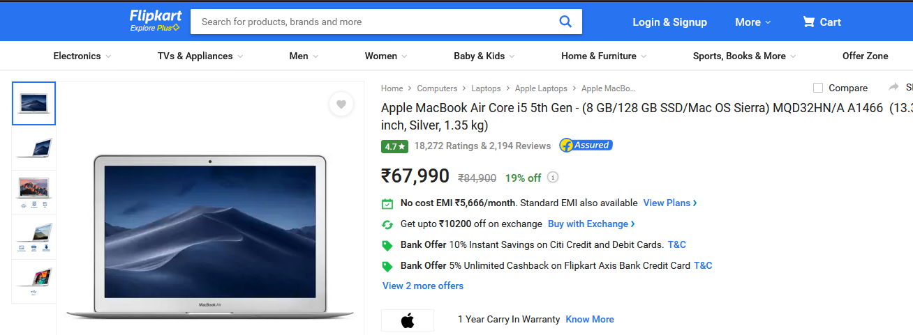

# Flipkart-Product-details-WebScrapping
Scrapping details from Flipkart

# Project Flow

## 1) Extracting *All Products* Details
 ### => Terminal Commands
  * run **products_search.py**.It will asks for query.Enter whatever you want to search for.
  * there **whatever you enter** is equals to **Search in Flipkart**
    * 
 
 ### => Actual Flipkart Website
  ### On 1st,2nd and 3rd Query
   * 
  
  
  ### Extraction Results
   * 
 
## 2) Extracting *Single Product* Details
 ### => Actual Website
  * 
 
 ### => Extraction Results
   

